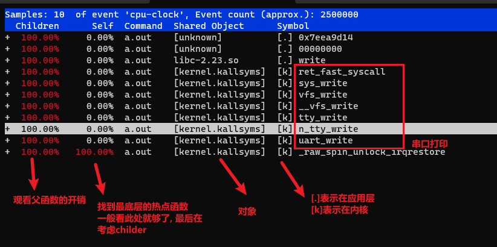
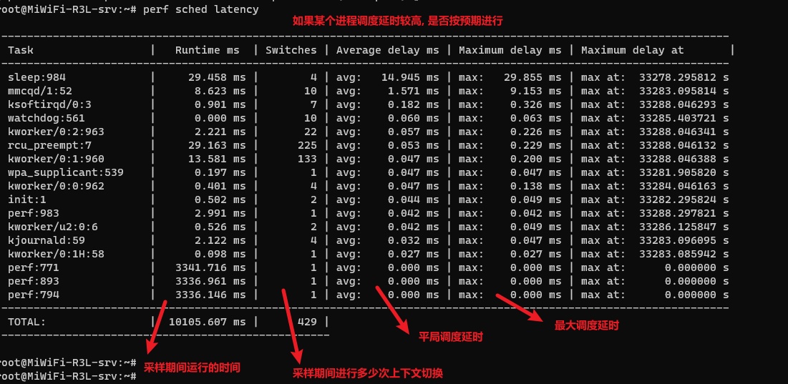

perf
===========

1 perf功能
--------------------

  perf常用功能是定位热点函数, perf不仅能分析软件, 还能分析硬件, 这是比ftrace的优势.
  perf 用于粗粒度的调试主要定位热点函数

1.1 使用流程
*********************

.. code-block:: c

    # 1 采集数据生成perf.data
    # 2 分析数据

2 通用命令
--------------------

.. code-block:: c

    ################################### 1 查看可以跟踪的函数
    perf list

    ################################### 2 分析系统调用
    # 类似strace, 比strace性能高
    perf trace <cmd>
    perf trace ls

3 分析数据
--------------------

.. code-block:: c

    # 方法1
    perf report

    # 方法2 
    perf script

4 采集数据
--------------------

4.1 基础采集
*****************

============= ==========================
-a            从所有cpu上采集
-g            启用栈回溯, 可以看到调用栈
-p            指定进程id
-F            指定采样频率
--sleep       采样时间
============= ==========================

.. code-block:: c

    ################################### 1 记录pid
    perf record -p [pid]
    perf record -p 1021 -a -g -F99 -- sleep 10

    ################################### 1 直接根命令
    perf record -g ls

4.2 自定义采集
*************************

.. code-block:: c

   # 添加do_sys_open
   perf probe --add do_sys_open

   # 追踪probe
   perf record -e probe:do_sys_open -aR sleep 1

   # 查看
   perf report

5 统计
--------------------

======================= ============================
task-clock              cpu工作的时间
contex-switches         进程切换次数
cpu-migrations          程序在运行过程中cpu迁移的次数
page-faults             缺页次数
======================= ============================

.. code-block:: shell

    $ perf stat ./a.out

    Performance counter stats for './a.out':

           7.939999      task-clock (msec)         #    0.001 CPUs utilized          
                  8      context-switches          #    0.001 M/sec                  
                  0      cpu-migrations            #    0.000 K/sec                  
                 36      page-faults               #    0.005 M/sec                  
    <not supported>      cycles                   
    <not supported>      stalled-cycles-frontend  
    <not supported>      stalled-cycles-backend   
    <not supported>      instructions             
    <not supported>      branches                 
    <not supported>      branch-misses            

    6.483082668 seconds time elapsed

6 实时查看系统
--------------------

.. code-block:: c

    perf top

7 分析内存
------------------------

.. code-block:: c

    perf kmem record
    perf kmem report

8 分析锁
-----------------

.. code-block:: c

    perf lock record 
    perf lokc report

9 分析调度性能
--------------------

   这里建议分析全部任务, 不是-p指定pid

.. code-block:: c

    # 1 获取数据
    perf sched record
    perf sched record -p 971 -- sleep 10

    # 2 分析 - 按script展示
    perf sched script

    # 3 分析 - 延时(很重要)
    perf sched latency

    # 4 分析 - 按报告形式
    perf sched report

10 火焰图制作
-----------------

.. code-block:: c

    # 参考博客
    https://blog.csdn.net/weixin_42467874/article/details/128936272

    # 火焰图制作工具github, 该上面也有文档
    https://github.com/brendangregg/FlameGraph

    # 参考流程
    # 1 收集数据
    perf record -g -p 28591

    # 2 解析数据
    perf script -i perf.data &> perf.unfold

    # 3 折叠数据
    ./stackcollapse-perf.pl perf.unfold &> perf.folded

    # 4 生成火焰图
    ./flamegraph.pl perf.folded > perf.svg
