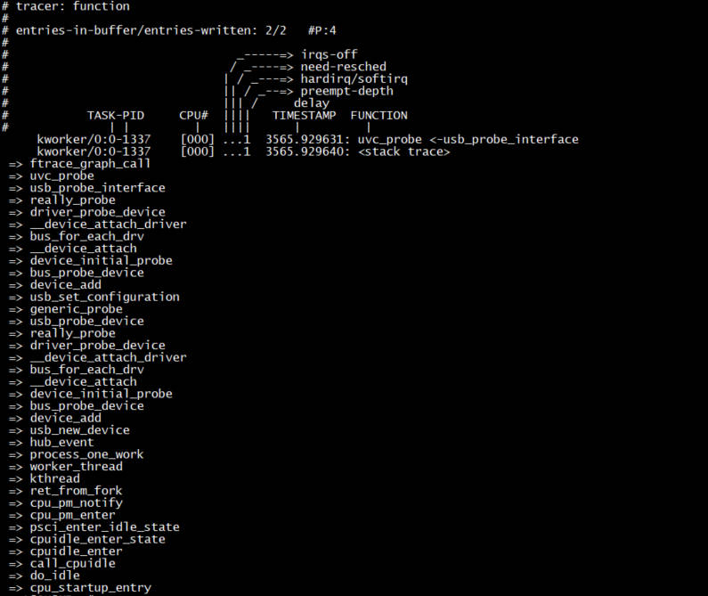

tracer - function
===================

1. 基本介绍
------------

function tracer用于跟踪函数的栈回溯

2. 使用流程
------------

.. code-block:: c

    # 设置function tracer
    echo function > current_tracer

    # 设置要跟踪的函数, 以uvc_probe为例
    echo "uvc_probe" > set_ftrace_filter

    # 使能栈回溯
    echo 1 > options/func_stack_trace

    # 开启traceer
    echo 1 > tracing_on

    # 查看结果
    cat trace

